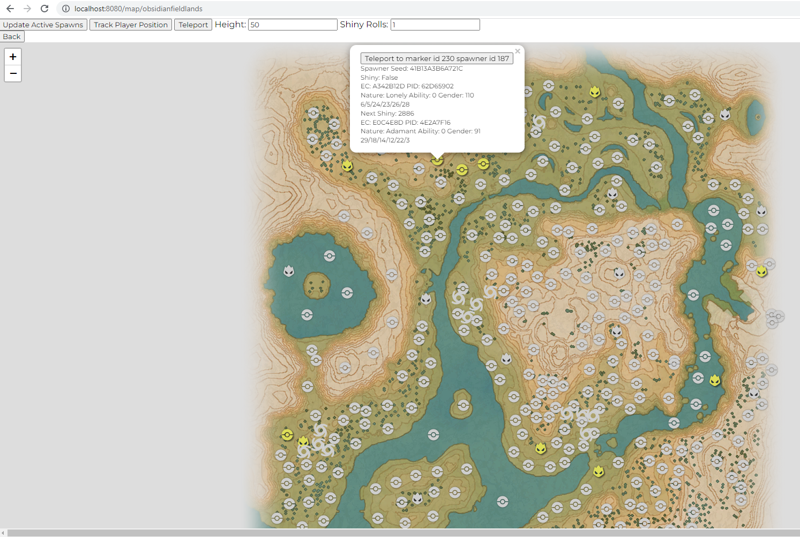

# PLA-Live-Map
Flask application that displays live information on an interactive map for Pokemon Legends: Arceus.

# How to run:
1. Install Flask ``pip install flask``
2. Copy-paste ``config.json.template`` and rename to ``config.json``
3. Edit the ``IP`` field to contain your switch's IP
4. Run main.py ``python3 ./main.py``
5. Open ``http://localhost:8080/`` in your browser
6. Select your current map

# Current features
- Ability to read all active spawns with "Update Active Spawns" (Pokemon are displayed as a red pokeball)
- Ability to track and display the players current position on the map with "Track Player Position"
- Ability to teleport to any location on the map at the specified height on click with "Teleport"
- Ability to teleport to specific markers on the map with "Teleport to marker id X" in the marker pop-up
- Ability to read the spawner information and next shiny advance of known spawner ids and/or active pokemon

# Credits
- berichan's [PLA Warper](https://github.com/berichan/PLAWarper) for the pointer to player location
- Serebii's [Pokearth](https://www.serebii.net/pokearth/hisui/) for the spawner locations
- Everyone in the rng community who is helping to catalog the spawner ids shown on the [PLA Spawner Map](https://lincoln-lm.github.io/JS-Finder/Gen8/PLA-Spawner-Map/)